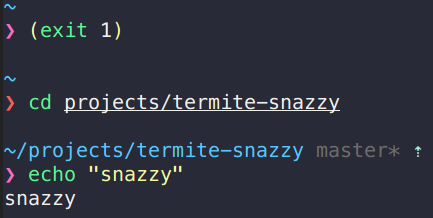

# termite-snazzy

> Elegant [Termite](https://github.com/thestinger/termite) theme with bright colors

## Install

Extend your `$HOME/.config/termite/config` with [`config`](https://raw.githubusercontent.com/kbobrowski/termite-snazzy/master/config)

## Related

- [hyper-snazzy](https://github.com/sindresorhus/hyper-snazzy) - Hyper version (original version by Sindre Sorhus)
- [iterm2-snazzy](https://github.com/sindresorhus/iterm2-snazzy) - iTerm2 version
- [terminal-snazzy](https://github.com/sindresorhus/terminal-snazzy) - Terminal version
- [konsole-snazzy](https://github.com/miedzinski/konsole-snazzy) - Konsole version
- [vscode-snazzy](https://github.com/Tyriar/vscode-snazzy) - VS Code version
